<h1 align="center">
  <a href="https://smurg.ai/zh-TW/"></a>
  <br>
  smurg
</h1>

<p align="center"><b>給團隊和 Claude&nbsp;Code 用的即時協作工作區。</b></p>

<p align="center">
  <a href="https://smurg.ai/zh-TW/">網站</a> ·
  <a href="https://smurg.ai/zh-TW/docs/quick-start/">快速上手</a> ·
  <a href="https://smurg.ai/zh-TW/docs/">文件</a> ·
  <a href="README.md">English</a>
</p>

<p align="center">
  <a href="https://github.com/gclinian/smurg/actions/workflows/ci.yml"></a>
  <a href="https://github.com/gclinian/smurg/releases/latest"></a>
  <a href="docs/zh-TW/HOSTING.md#108-驗證過什麼還沒驗證什麼"></a>
</p>

<p align="center">
  <a href="https://smurg.ai/zh-TW/">
    <picture>
      <source media="(prefers-color-scheme: dark)" srcset=".github/assets/readme-picture-dark.zh-TW.svg">
      
    </picture>
  </a>
</p>

<p align="center"><sub>依網頁版繪製的示意圖，不是截圖；主題和人物是虛構的。</sub></p>

## 快速上手

1. 在放專案的那台電腦上（macOS 或 Linux，已經安裝並登入 Claude Code）安裝 smurg：

   ```sh
   curl -fsSL https://smurg.ai/install.sh | sh
   ```

2. 分享一個專案資料夾（至少有一個提交的 git 儲存庫）：

   ```sh
   smurg host ~/projects/my-app
   ```

   第一次執行時，它會先請你用 Google 帳號登入，接著印出兩個連結：一個給你自己（分享資料夾的人，以下叫主人），一個給組員。

3. 把組員的連結私訊給他們，他們用 Chrome 打開、用 Google 帳號登入就能加入，不需要安裝任何東西，也不需要 Claude 帳號。

4. 打開你自己的連結，按「新增主題」，團隊就可以開始和 agent 討論。

每一步怎麼做，一直到你看過、合併第一個主題的成果：[快速上手](https://smurg.ai/zh-TW/docs/quick-start/)。

> [!WARNING]
> **狀態：原型**。在 macOS（Apple Silicon）上開發和測試。主題的流程是用照劇本回應的模型替身驗證的，沒有用真正的 Claude 帳號（[驗證過什麼](docs/zh-TW/HOSTING.md#108-驗證過什麼還沒驗證什麼)）。agent 在主人的電腦上、以主人的身分執行，沒有沙盒，用的是主人的 Claude 帳號：請先讀[分享前必讀](docs/zh-TW/HOSTING.md#4-分享前必讀)和[「可使用 agent」角色](docs/zh-TW/HOSTING.md#51-可使用-agent角色請先讀)。

## 能做什麼

- **一起決定**：Claude 用選擇題請團隊決定；大家投票，再由一個人送出答案。
- **spec 和計畫都是檔案**：Claude 把 `SPEC.md` 和 `PLAN.md` 寫進你的專案，大家一起編輯。
- **每個工作項目一個 agent**：每個工作項目有自己的 Claude Code session 和 git worktree；agent 執行指令前會先問。
- **先看過，再合併**：完成的項目附有一份結果報告；有人看過之後，由主人合併。

除此之外，每個人有自己的收件夾，畫面最多可以並排四欄，角色有三種（「旁觀」「可編輯」「可使用 agent」），還有手寫 code 模式（共同編輯器和終端機）；介面有英文和繁體中文。這些在[組員指南](docs/zh-TW/JOINING.md)裡都有說明。

## 怎麼運作

- **你的電腦**執行 `smurg host`。檔案、agent 和它們的 git worktree 都留在這台電腦上。
- **relay** 在你和組員之間轉送資料，但讀不到內容：資料是端對端加密的（[relay 看得到什麼](docs/zh-TW/HOSTING.md#21-公用-relay預設)）。可以用公用的 <https://app.smurg.ai>，也可以[自己架設](apps/relay/README.md#self-hosting-on-workersdev)（英文）。
- **瀏覽器**是組員唯一需要的程式。

一頁看懂信任模型：[`docs/ARCHITECTURE.md`](docs/ARCHITECTURE.md#2-trust-model-in-one-page)（英文）。

## 文件

- [快速上手](docs/zh-TW/QUICKSTART.md)：一步一步，從安裝到你看過、合併第一個主題的成果
- [主人指南](docs/zh-TW/HOSTING.md)：安裝、分享、分享前必讀、agent 能做什麼、疑難排解、更新
- [組員指南](docs/zh-TW/JOINING.md)：角色、收件夾、和 agent 對話、主題從討論到看過結果
- [變更紀錄](docs/zh-TW/CHANGELOG.md)：每個版本的變更
- [架構](docs/ARCHITECTURE.md)（英文）：smurg 內部是怎麼設計的，以及已知的限制（§12）
- [安全性](SECURITY.md)（英文）：怎麼回報漏洞，以及哪些行為是刻意這樣設計的

同樣的指南，在網站上比較好讀：<https://smurg.ai/zh-TW/docs/>。這個儲存庫所有的文件，都列在 [`docs/DEVELOPMENT.md`](docs/DEVELOPMENT.md#documents)（英文）。

<details>
<summary><code>smurg</code> 指令</summary>

| 指令 | 作用 |
|---|---|
| `smurg host <資料夾>` | 分享資料夾（在前景執行），印出兩個連結：你自己的和給組員的 |
| `smurg attach [session]` | 把終端機 session 接到這個終端機（不指定時列出所有 session）；按 Ctrl-] 離開 |
| `smurg status` / `smurg stop` | 顯示或停止這台電腦正在分享的工作區 |
| `smurg login` / `smurg logout` | 用代碼登入 relay，或登出 |
| `smurg update` | 把安裝的執行檔更新到最新版本（`--check` 只檢查） |
| `smurg uninstall` | 先列出會移除什麼，再從這台電腦移除 smurg |
| `smurg licenses` | 顯示 smurg 的授權條款，以及執行檔裡第三方軟體的授權聲明 |

`smurg <指令> --help` 會印出那個指令的所有選項。

</details>

## 貢獻

回報問題或提出想法：請[開 issue](https://github.com/gclinian/smurg/issues)。送出修改之前要遵守的規則，寫在 [`CONTRIBUTING.md`](CONTRIBUTING.md)。怎麼從原始碼建置、執行檢查，以及在自己的電腦上把整套系統跑起來（加上 `--stand-in-claude` 就不需要帳號：agent 由照劇本回應的替身執行），都寫在 [`docs/DEVELOPMENT.md`](docs/DEVELOPMENT.md)。安全性問題請看 [`SECURITY.md`](SECURITY.md)，不要開公開的 issue。這三份文件都是英文。

## 授權

smurg 是開放原始碼軟體，以 MIT 授權條款釋出：見 [`LICENSE`](LICENSE)。執行檔與網頁版包含的第三方軟體，各自依照它們自己的授權：[`packages/cli/THIRD-PARTY-NOTICES.txt`](packages/cli/THIRD-PARTY-NOTICES.txt) 與 [`apps/web/public/third-party-notices.txt`](apps/web/public/third-party-notices.txt)。
